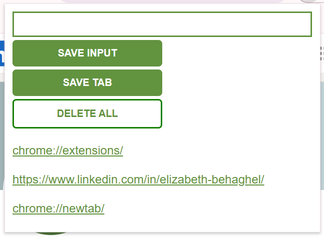

# 🔗 LinkDrop - Chrome Extension

LinkDrop is a lightweight Chrome extension that lets you quickly save and manage useful text or URLs. Whether you're jotting down a thought, saving a link, or capturing your current tab, LinkDrop helps you keep track of what matters — with a simple, focused UI.

---

## 🚀 Features

- ✅ Save typed-in text or links

- ✅ One-click save of the current tab’s URL

- ✅ Persistent storage using localStorage

- ✅ Double-click to delete all saved entries

- ✅ Clean and responsive user interface

---

## 🧰 Tech Stack

- HTML
- CSS
- JavaScript
- Chrome Extensions API (`tabs` permission)

---

## 📦 Installation & Setup

1. **Clone or download** the repo to your computer.
2. Go to `chrome://extensions/` in your Chrome browser.
3. Enable **Developer Mode** (toggle in the top right).
4. Click **"Load unpacked"**.
5. Select the project folder (containing `manifest.json`).
6. The extension should now appear in your browser toolbar.

---

## 🧪 Usage

- Click the extension icon to open the popup.
- Type a link into the input box and click **"Save Lead"**.
- Click **"Save Tab"** to store the URL of the current browser tab.
- Double-click **"Delete All"** to clear all saved links.

---

## 🔒 Permissions

This extension requests:
- `tabs` – to access the URL of the currently active tab when saving.

---

## 📝 Notes

- Saved leads are stored in the browser’s local storage and will persist across sessions.
- Make sure to reload the extension after editing any files via `chrome://extensions`.

---

## 📷 (Optional) Screenshot

---

## 💡 Ideas for Improvement

- Add option to edit or delete individual leads
- Sync leads to Chrome account using Chrome Storage
- Add tags or folders to organize saved leads
- Export leads to a file

---

## 📄 License

MIT License – Use freely, modify, and share.

---

## 🙌 Author

Built by Elizabeth Behaghel ✨  
